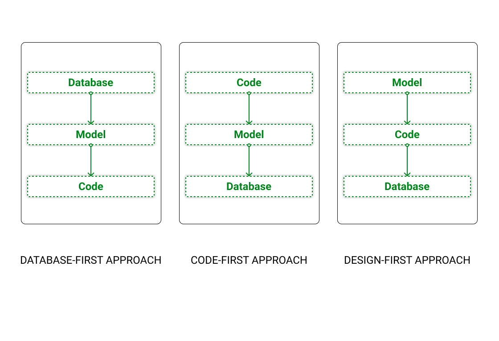

# API-Development-in-Django



    pip install virtualenv
    virtualenv env
    env\Scripts\activate
    pip install django
    pip install django-rest-framework
    pip install drf-yasg[validation]
    pip install django-cors-headers
    pip freeze > requirements.txt
    pip install -r requirements.txt
    django-admin startproject server_config .
    cd api
    python manage.py startapp api


    INSTALLED_APPS = [
        'corsheaders',
        'rest_framework',
        'drf_yasg',
    ]

    MIDDLEWARE = [
        'corsheaders.middleware.CorsMiddleware',
    ]


    REST_FRAMEWORK = {
        'DEFAULT_PERMISSION_CLASSES': (
            'rest_framework.permissions.AllowAny',
        )
    }

in url

    from rest_framework import permissions
    from drf_yasg.views import get_schema_view
    from drf_yasg import openapi

    schema_view = get_schema_view(
    openapi.Info(
        title="API_NAME",
        default_version='v3',
        description="Description",
        terms_of_service="URL",
        contact=openapi.Contact(email="EMAIL_ID"),
        license=openapi.License(name="BSD License"),
    ),
    public=True,
    permission_classes=(permissions.AllowAny,),
    )

    urlpatterns = [
        path('admin/', admin.site.urls),
        path('', schema_view.with_ui('swagger', cache_timeout=0), name='schema-swagger-ui'),
        path('doc/', schema_view.with_ui('redoc', cache_timeout=0), name='schema-redoc'),
    ]


```

'default': {
    'ENGINE'   : 'django.db.backends.mysql',
    'NAME'     : 'DB_NAME',
    'USER'     : 'DB_USER_NAME',
    'PASSWORD' : 'DB_PASS',
    'HOST'     : 'localhost',
    'PORT'     : '3306',
    }
    
```

Add 2 Files

    urls.py
    serializers.py


   python manage.py inspectdb